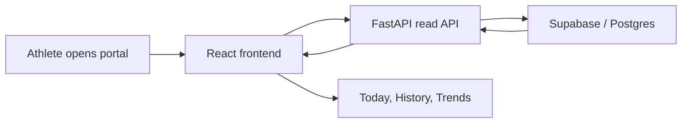

# APEX Progress Portal Implementation

## Purpose

APEX Progress Portal is a read-only companion web app for the existing APEX
MCP wellness backend. It gives the athlete a simple place to review:

- the current day
- recent logged days
- longer-term trends in fuelling and training

This repo intentionally does not recreate the full product workspace. The goal
is a focused review surface that is easy to deploy, easy to understand, and
easy to maintain.

## Product Context

The existing APEX ecosystem already stores persistent wellness data in the
Postgres schema behind `apex-mcp-server`. The portal reads those MCP wellness
records directly so the review experience matches the same data the MCP tools
already expose.

For this portal, only the read side matters. The athlete should be able to open
one website and quickly answer questions such as:

- How is today going against the target?
- What did I eat and what training did I do?
- Which previous days are worth reviewing?
- Is my fuelling and training trend moving in the right direction?

## What Is Deployed

- A React frontend served from `frontend/`
- A FastAPI backend served from `backend/index.py`
- A single Vercel project using Services routing
- A Supabase/Postgres connection string passed by environment variable

## High-Level Workflow

## Main Components

### Frontend

- `frontend/src/App.tsx`
  Main portal state, section switching, loading, and unlock handling.
- `frontend/src/components/Brand.tsx`
  APEX icon and wordmark components reused across the portal.
- `frontend/src/components/PortalShell.tsx`
  Sidebar, header, and content shell.
- `frontend/src/lib/api.ts`
  Small fetch client for the backend endpoints.

### Backend

- `backend/src/apex_portal_api/main.py`
  FastAPI app assembly and route definitions.
- `backend/src/apex_portal_api/config.py`
  Environment-driven runtime settings.
- `backend/src/apex_portal_api/store.py`
  Supabase/Postgres read queries aligned to the MCP wellness tables.
- `backend/src/apex_portal_api/models.py`
  Typed API response models used by the routes.

## Data Inputs

The backend reads from these existing tables:

- `user_profiles`
- `daily_targets`
- `daily_meals`
- `meal_items`
- `activity_entries`

The portal does not write to those tables. It only aggregates and presents the
data already stored by the MCP workflows.

## Important Design Decisions

### Single-athlete subject binding

The portal reads one configured `APEX_PORTAL_SUBJECT`, exactly like the MCP
storage layer does. That keeps the portal aligned with the same caller-scoped
data model instead of introducing a second identity mapping layer.

### Latest tracked day default

The portal opens on the latest tracked day instead of blindly opening the
current calendar day. This matters because a read-only review portal is much
more helpful when it lands on the most recent real data instead of an empty
screen on rest days or before the first log of the day.

### Optional portal access token

An optional `APEX_PORTAL_ACCESS_TOKEN` lets the deployed site stay private
without introducing a larger auth workflow. If the token is configured, the
frontend shows a minimal unlock screen and the backend expects a bearer token.

### Read-only API surface

The backend only exposes the reporting views the portal needs:

- portal bootstrap/context
- one day snapshot
- history summaries
- trend series

That keeps the backend small and lowers the risk of drifting away from the
authoritative MCP data model.

## Outputs

The user-facing outputs are:

- a today snapshot with meal and activity detail
- a history list with quick adherence and activity context
- a trends view showing longer-term evolution

## Dependencies

- Backend: `uv`, FastAPI, asyncpg, pydantic-settings
- Frontend: React, Vite, Vitest
- Deployment: Vercel Services
- Data source: Supabase/Postgres

## Review Notes

When reviewing future changes, the most important question is whether the
portal still matches the `apex-mcp-server` storage semantics. If the MCP
server changes how it stores targets, meals, or activities, the portal queries
and README should be updated at the same time.
