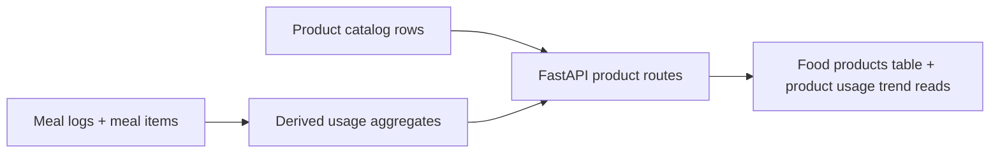

# Product Consumption Analytics

## Purpose

The portal now exposes derived product consumption analytics so the athlete can
see which reusable foods are actually being used most often.

This supports three near-term product needs:

- ranking favorite or common products
- spotting reusable product trends over time
- providing a safer base for future meal suggestion logic

The important design rule is that usage stays derived from meal facts. This
repo does **not** store a mutable `usage_count` on `food_products` or
`food_items`.

## Why This Exists

Meals and meal ingredients are the only reliable record of consumption. Product
rows are catalog records, so they can be edited, renamed, merged, or deleted
without changing what the athlete actually consumed on a given day.

If the app wrote counters directly onto product rows, those counters could
quietly drift when meal data is corrected or replayed. Deriving usage from meal
facts keeps the numbers explainable and rebuildable.

## High-Level Flow



## Data Sources

The portal supports the same two wellness schema variants as the rest of the
backend:

- Legacy usage facts:
  `public.daily_meals` joined to `public.meal_items.product_id`
- Normalized usage facts:
  `public.meal_logs` joined to `public.meal_ingredients.food_id`

Only linked ingredient rows count toward product usage. Free-text ingredients
without a product id are excluded from counts instead of being guessed by name.

## Implemented Read Models

### Product catalog usage summary

`GET /portal/products` now accepts:

- `date_to`: optional inclusive upper bound for the usage window
- `window_days`: optional trailing window size, default `30`

Each product row includes:

- `usage.total_usage_occurrences`
- `usage.total_usage_days`
- `usage.total_grams`
- `usage.total_calories`
- `usage.window_usage_occurrences`
- `usage.window_usage_days`
- `usage.window_total_grams`
- `usage.window_total_calories`
- `usage.first_used_on`
- `usage.last_used_on`

The response also includes `window_date_from`, `window_date_to`, and
`window_days` so the UI can describe the active window clearly.

### Per-product usage trends

`GET /portal/product-usage/trends` returns an oldest-first daily series for one
product id. The route accepts:

- `product_id`
- `date_to`
- `days`

Each daily point contains:

- `date`
- `usage_occurrences`
- `total_grams`
- `total_calories`

The summary contains:

- `logged_days`
- `total_usage_occurrences`
- `total_grams`
- `total_calories`
- `last_used_on`

## Important Decisions

### Logged meal values win over current catalog values

Usage totals use the meal item's stored grams and nutrition values. That means
historical usage does not change just because a product's current catalog entry
is edited later.

### Business date is the time axis

Product usage follows the same day-boundary rules as the rest of the portal:

- legacy uses `meal_date`
- normalized uses `timezone(APEX_PORTAL_TIMEZONE, logged_at)::date`

This keeps product trends aligned with the existing history and trends screens.

### No fuzzy matching

Rows without a linked product id are intentionally excluded. That is safer than
trying to infer products from free-text ingredient names and risking silent
miscounts.

## Validation

The implementation is covered by:

- backend API tests for `/portal/products` and `/portal/product-usage/trends`
- backend store tests for usage summary and daily trend mapping
- frontend tests for product-table rendering, usage sorting, and window copy

Manual verification commands:

```bash
cd backend
uv run pytest

cd ../frontend
npm test -- --run
npm run build
```

## Follow-Up Ideas

- add co-occurrence data for “often paired with” suggestions
- add typical serving sizes from historical median grams
- expose coverage metrics for unlinked meal ingredients
- add a product trend view in the React UI when the athlete needs deeper
  analytics than the table provides
