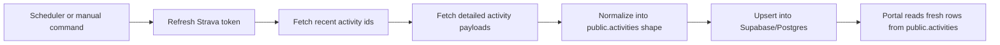

# Strava Sync Implementation

## Purpose

This repo now includes a very small backend-side Strava sync for one athlete.
Its job is simple:

1. refresh the latest Strava access token
2. fetch recent Strava activities
3. normalize them into the APEX `public.activities` shape
4. upsert them into Supabase/Postgres

The goal is to keep the ingestion path understandable for a new contributor.
This is not a standalone Strava service and it intentionally avoids webhooks,
OAuth callback routes, worker frameworks, or extra infrastructure.

## Why This Exists

The portal already reads activity data from `public.activities`. Adding a small
Strava pull job inside the backend keeps the portal data fresh without creating
another service to deploy and maintain.

This is especially useful for the current single-athlete setup where:

- one Postgres database already exists
- one `user_id` can be targeted
- idempotent upserts are enough
- a fixed schedule is acceptable

## Source Of Truth

Supabase/Postgres is the source of truth.

We do **not** keep a local file or SQLite copy of activities. The sync reads
from Strava and writes directly into `public.activities`.

To keep repeated runs safe, the backend creates a unique Postgres index on
`(user_id, strava_id)` and uses `ON CONFLICT ... DO UPDATE`. That means:

- re-running the sync does not create duplicate Strava rows
- manual activity rows with `strava_id = NULL` remain untouched
- the database stays canonical

The only extra operational state is a tiny `strava_oauth_tokens` table used to
store the rotated refresh token and short-lived access token returned by
Strava.

## Main Workflow



## Important Components

- `backend/src/apex_portal_api/strava_sync.py`
  The single focused sync module. It contains:
  - the Strava HTTP client
  - the Postgres token/activity store
  - the normalization helpers
  - the manual CLI entrypoint

## Inputs

Required runtime inputs:

- `DATABASE_URL` or `APEX_DATABASE_URL`
- `STRAVA_CLIENT_ID`
- `STRAVA_CLIENT_SECRET`

Required on the first successful run:

- `STRAVA_REFRESH_TOKEN`

Recommended operational inputs:

- `APEX_PORTAL_USER_ID`
- `STRAVA_SYNC_LOOKBACK_HOURS`
- `STRAVA_REQUEST_TIMEOUT_SECONDS`

## Outputs

The sync writes:

- token state into `strava_oauth_tokens`
- normalized activities into `public.activities`

The sync returns:

- the target `user_id`
- whether the refresh token came from Postgres or env
- fetched activity ids
- upserted activity ids
- start and completion timestamps

## Scheduler Model

### Manual local run

```bash
cd backend
uv run python -m apex_portal_api.strava_sync
```

Or from the repo root:

```bash
make sync-strava
```

### Scheduled run

Use any simple system scheduler that can run a Python command. For example, on
Linux or a small VPS:

```cron
*/16 * * * * cd /path/to/apex-UI/backend && /usr/bin/env uv run python -m apex_portal_api.strava_sync >> /var/log/apex-strava-sync.log 2>&1
```

That means the sync remains a plain Python job and does not depend on Vercel
cron support.

## Important Decisions

### Why we persist tokens in Postgres

Strava rotates refresh tokens. After a successful token refresh, the newest
refresh token must be used on later runs. Storing that rotated token in
Postgres keeps the job simple and reliable without needing a full OAuth UI in
this repo.

### Why the sync uses a recent lookback window

The sync fetches only a trailing window instead of the athlete's full history.
That keeps each run small while still allowing a healthy overlap between runs.
The default window is `72` hours.

### Why we do not compute advanced training metrics here

This implementation keeps normalization intentionally light. It maps the fields
the portal already reads and only preserves simple extra metadata. It does not
add benchmark lookup, zones, laps, webhook replay, or a separate analytics
pipeline.

## Validation Checklist

- `uv run pytest`
- `uv run ruff check .`
- run `uv run python -m apex_portal_api.strava_sync` once with real Strava env
- confirm rows land in `public.activities`
- confirm a second run updates the same `strava_id` rows instead of inserting duplicates
